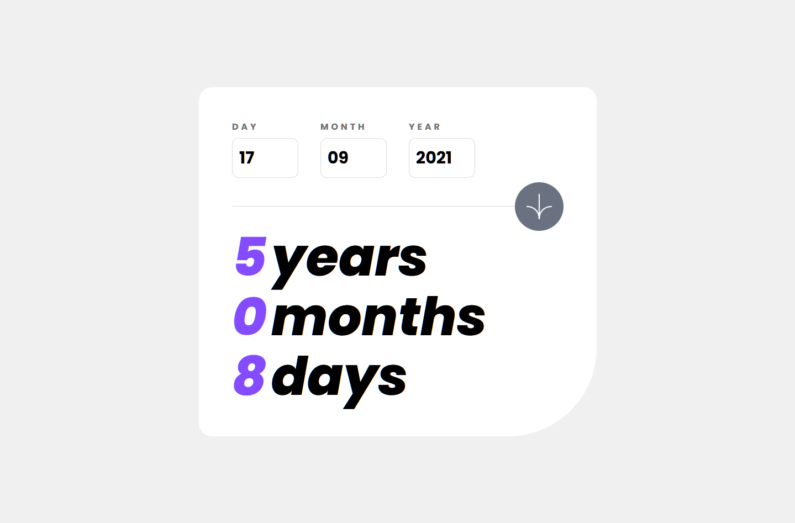
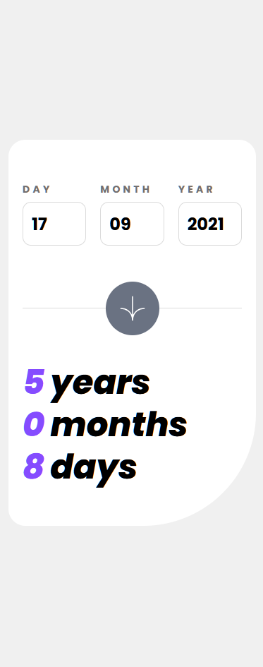

# Frontend Mentor - Age calculator app solution

This is a solution to the [Age calculator app challenge on Frontend Mentor](https://www.frontendmentor.io/challenges/age-calculator-app-dF9DFFpj-Q). Frontend Mentor challenges help you improve your coding skills by building realistic projects. 

## Table of contents

- [Overview](#overview)
  - [The challenge](#the-challenge)
  - [Screenshot](#screenshot)
  - [Links](#links)
- [My process](#my-process)
  - [Built with](#built-with)
  - [What I learned](#what-i-learned)
  - [Continued development](#continued-development)
  - [Useful resources](#useful-resources)
  - [AI Collaboration](#ai-collaboration)
- [Author](#author)
- [Acknowledgments](#acknowledgments)

**Note: Delete this note and update the table of contents based on what sections you keep.**

## Overview

### The challenge

Users should be able to:

- View an age in years, months, and days after submitting a valid date through the form
- Receive validation errors if:
  - Any field is empty when the form is submitted
  - The day number is not between 1-31
  - The month number is not between 1-12
  - The year is in the future
  - The date is invalid e.g. 31/04/1991 (there are 30 days in April)
- View the optimal layout for the interface depending on their device's screen size
- See hover and focus states for all interactive elements on the page
- **Bonus**: See the age numbers animate to their final number when the form is submitted

## Screenshots

### Desktop

*Desktop view of the age calculator*

### Mobile

### Links

- Solution URL: https://github.com/williambrooks84/age-calculator-app
- Live Site URL: https://williambrooks84.github.io/age-calculator-app/

## My process

### Built with

- Mobile-first workflow
- [React](https://reactjs.org/) - JS library
- [TailwindCSS](https://tailwindcss.com/) - For styles

### Useful resources

- [TailwindCSS documentation](https://tailwindcss.com/) - This documentation helped me find the correct properties for the styling.

### AI Collaboration

- [ChatGPT](https://chatgpt.com/) - I didn't use ChatGPT to generate code, however I used it to have help with finding the correct method to make functions detecting the leap years, the dates that do and don't exist, etc. I also used it to have help deploying the project.

## Author

- Website - [William Brooks](https://willbrooks.fr)
- Frontend Mentor - [@williambrooks84](https://www.frontendmentor.io/profile/williambrooks84)